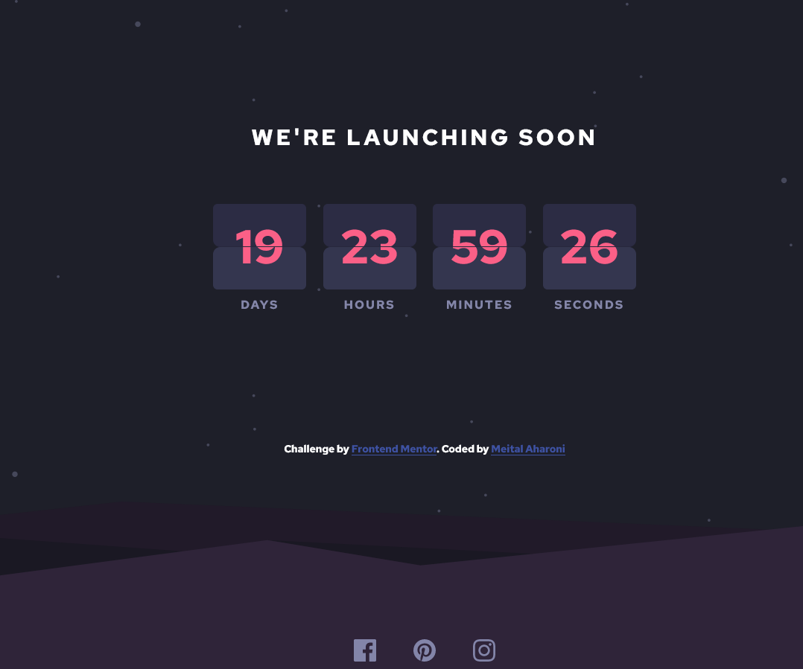

# Frontend Mentor - Launch countdown timer solution

This is a solution to the [Launch countdown timer challenge on Frontend Mentor](https://www.frontendmentor.io/challenges/launch-countdown-timer-N0XkGfyz-). Frontend Mentor challenges help you improve your coding skills by building realistic projects.

## Table of contents

- [Overview](#overview)
  - [The challenge](#the-challenge)
  - [Screenshot](#screenshot)
  - [Links](#links)
- [My process](#my-process)
  - [Built with](#built-with)
  - [What I learned](#what-i-learned)
  - [Useful resources](#useful-resources)
- [Author](#author)

## Overview

### The challenge

Users should be able to:

- See hover states for all interactive elements on the page
- See a live countdown timer that ticks down every second (start the count at 14 days)
- **Bonus**: When a number changes, make the card flip from the middle

### Screenshot



### Links

- Solution URL: [Add solution URL here](https://github.com/meital10/launch-countdown-timer)
- Live Site URL: [Add live site URL here](https://meital-countdown-timer.netlify.app/)

## My process

### Built with

- Semantic HTML5 markup
- CSS custom properties
- Flexbox
- CSS Grid
- Media Queries
- Vanilla JS

### What I learned

I learned how to divide the card to top and bottom and make manipulations using both CSS and JS to make flip animation and to practice website responsiveness.

```css
.card-value .top-flip {
  position: absolute;
  width: 100%;
  animation: flip-top 250ms ease-in;
  transform-origin: bottom;
}

@keyframes flip-top {
  100% {
    transform: rotateX(90deg);
  }
}

.card-value .bottom-flip {
  position: absolute;
  bottom: 0;
  width: 100%;
  animation: flip-bottom 250ms ease-out 250ms;
  transform-origin: top;
  transform: rotateX(90deg);
}

@keyframes flip-bottom {
  100% {
    transform: rotateX(0deg);
  }
}
```

```js
topFlip.addEventListener("animationstart", (e) => {
  topHalf.textContent = newNumber;
});
topFlip.addEventListener("animationend", (e) => {
  topFlip.remove();
});
bottomFlip.addEventListener("animationend", (e) => {
  bottomHalf.textContent = newNumber;
  bottomFlip.remove();
});
flipCard.append(topFlip, bottomFlip);
```

### Useful resources

- [Example resource 1](https://www.youtube.com/watch?v=p_6IuhmBsfc&list=LL&index=7&t=8s) - Web Dev Simplified. This helped me to understand how to make flip animation.

## Author

- GitHub with a link to my Portfoilio - [Meital](https://github.com/meital10)
- Frontend Mentor - [@meital10](https://www.frontendmentor.io/profile/meital10)
